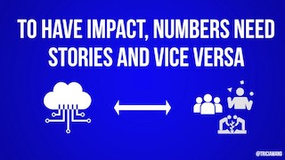
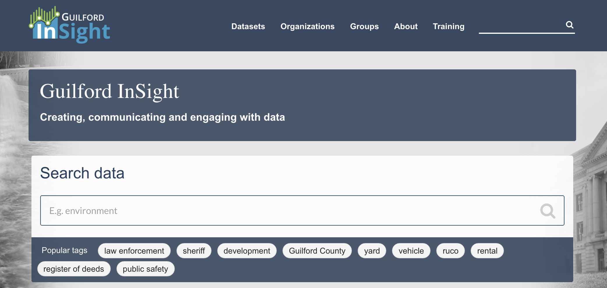

## GOVERNMENT OPEN DATA  
**Jason Jones**  
*Analytics & Innovation Manager*  
*Guilford County Government*  
  
  

## OUTLINE 
  
- Open Data: Past and Present
- Open Government
- Musings on Future  
- Your Turn  

## WHAT IS OPEN DATA?  
> "Open data means data that is available online, in an open format, with no legal encumbrances on use or reuse, and is available for all to access and download in full without fees or a requirement of registration."  

 
Source: http://opendata.myguilford.com/dataset/open-data-policy-and-governance/resource/99be58db-5051-44bd-aad0-77fc36b07e5e

## FIRST MENTION  
>"The term open data appeared for the first time in 1995...about the disclosure of geophysical and environmental data...before being a technical object or political movement, open data was rooted in the praxis of the scientific community. Researchers were the first who perceived the benefit of openness and of sharing of data."

Source: http://parisinnovationreview.com/articles-en/a-brief-history-of-open-data

## PUBLIC SECTOR EMERGENCE  
In 2007, some people got together north of San Francisco and decided...  

>"The basic idea is that public data are a common property, in the same way as scientific ideas...directly inspired by the approach and practice of open source, built on three concepts: openness, participation and collaboration."

Source: http://parisinnovationreview.com/articles-en/a-brief-history-of-open-data

## THANKS OBAMA
- Signed two presidential memoranda concerning open government
- Open source culture foundation: transparency, participation, and collaboration 
- Direct connection/reference to 2007 meeting

## THE PRESENT
- Not as broadly adopted as you would hope
- Primarily about transparency, less about collaboration

Source: http://www.opendatapolicies.org/browse/

## THE PRESENT
- Meaningful implementation is difficult
- Data skills & literacy gap (internal & external)
- Most useful data is often most protected
- All about trust & relationships

## BONUS SLIDE: POPULAR DATA

## WHAT IS OPEN GOVT?  
- High levels of transparency
- Mechanisms for public scrutiny and oversight
- Emphasis on accountability
- Increased citizen participation & collaboration

Source: https://opensource.com/resources/open-government

## THE DISTINCTION IS IMPORTANT  
- You **CAN** have open data w/out open govt
- You **CAN NOT** have open govt w/out open data  

  
The combination of open data & open government will not be the exception, it will be the expectation

## THE FUTURE OF OPEN DATA  

  

  >"...the goal isn’t anymore to change the world through data but to try, more modestly, to modernize public action."
  
  

  

  
  
  
  

Source: http://parisinnovationreview.com/articles-en/a-brief-history-of-open-data

## BUT HOW?
- **Joy's Law:** There is cumulatively more knowledge and talent outside of an organization than in it
- Look towards the sharing economy as a model
- Shifting towards more **participation and collaboration**

Source: http://elgl.org/2016/03/13/break-it-down-open-data-and-the-sharing-economy/

## BUT DON'T FORGET
>"What is measurable isn't the same as what is valuable"  

  
Local government will become increasingly responsible for gathering & providing sufficient context

Source: https://medium.com/ethnography-matters/why-big-data-needs-thick-data-b4b3e75e3d7

## THICK DATA
>"Thick Data is data brought to light using qualitative, ethnographic research methods that uncover people’s emotions, stories, and models of their world."

Source: https://medium.com/ethnography-matters/why-big-data-needs-thick-data-b4b3e75e3d7

## GETTING THERE

Source: https://sunlightfoundation.com/2017/09/19/introducing-a-guide-to-tactical-data-engagement/

## SHAMELESS PLUG

Link: http://opendata.myguilford.com/

## BUILDING THE FUTURE - WITH YOU!  

  

We want our data to be:  

- Useful
- Usable
- Used 

  

  

  
  
  
  

## HOW CAN YOU HELP?  
I'm so glad you asked!

 
Source: http://stories.datarefuge.org/

## THANK YOU SO MUCH!
 
Email: jjones6@guilfordcountync.gov  
Office: (336) 641-6078  
  
Twitter: @packpridejones  

